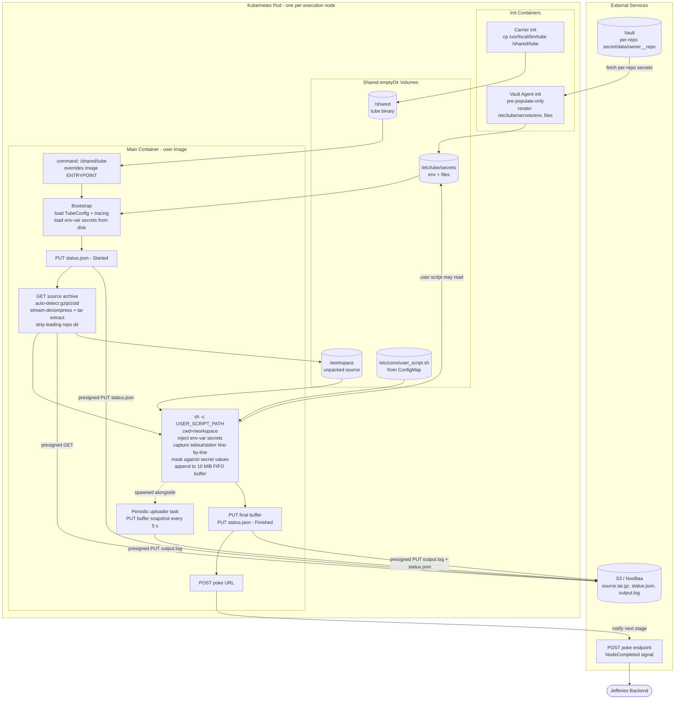

## **The Conn: Tube Architecture**

### **1. Core Philosophy**
* **Single Purpose:** `tube` is the per-node execution agent for a Conn pipeline. One process, one node, one user script — no daemons, no multiplexing, no in-process scheduler.
* **Image-Agnostic:** Statically linked against `musl` so the binary is portable into any container image (Alpine, UBI, Debian-slim, distroless variants, third-party tooling images) without dragging shared libraries along. The user picks the image; `tube` is injected as the entrypoint.
* **Stateless & Externalized:** Every input arrives over the environment (presigned URLs, identifiers, mount paths) and every output leaves over HTTP (status JSON, logs, poke). The pod has no durable disk and no broad credentials of its own — it can only act on what the backend hands it for this run.
* **Defensive by Default:** No `unwrap`/`expect` in production paths, fallible operations propagate through a unified error enum, captured user output is masked against env-var secret values before it ever leaves the process, and the in-memory log buffer is bounded so a runaway script cannot OOM the pod.

---

### **2. Pod Composition**

A node executes inside a single Kubernetes Pod assembled by the backend's dispatcher. The Pod has three mount points and three containers:

#### **Mounts (all `emptyDir`)**
* `tube-bin` → `/shared` — receives the `tube` binary from the carrier init container.
* `workspace` → `/workspace` — disk-backed scratch space where the source archive is unpacked and where the user script runs.
* `user-script` → mounted from a `ConfigMap` containing the shell script built from the node's `steps:` block.

Vault projects an additional volume at `/etc/tube/secrets/` (with `env/` and optionally `files/` subtrees, plus per-secret overrides for absolute paths) via the Vault Agent Injector.

#### **Init Containers** (run in order, both unprivileged)
1. **Carrier — `quay.io/the-conn/tube:latest`.** Default `CMD` is `cp /usr/local/bin/tube /shared/tube`. Mounts `tube-bin` at `/shared` and exits as soon as the binary is in place.
2. **Vault Agent (injected).** The dispatcher annotates the Pod with `vault.hashicorp.com/agent-inject: "true"`, `agent-pre-populate-only: "true"`, `secret-volume-path: /etc/tube/secrets`, and one `(agent-inject-secret-<id>, agent-inject-template-<id>, agent-inject-file-<id>)` triple per declared secret. Names from `secrets.env:` render under `/etc/tube/secrets/env/<NAME>`; bare names from `secrets.files:` render under `/etc/tube/secrets/files/<NAME>`; entries with an explicit `path:` get a `secret-volume-path-<id>` override and render to that absolute path. Pre-populate mode means the agent writes once and exits — no sidecar persists into the run.

#### **Main Container — User Image**
* `image:` is whatever the node's YAML specified (e.g. `quay.io/buildah/stable:latest`).
* `command:` is overridden by the dispatcher to `["/shared/tube"]`. The image's own `ENTRYPOINT`/`CMD` is irrelevant — `tube` becomes PID 1 of the application container.
* All required `TUBE__*` environment variables are injected: `STATUS_PUT_URL`, `LOGS_PUT_URL`, `POKE_URL`, `RUN_ID`, `NODE_NAME`, `USER_SCRIPT_PATH` (typically `/etc/conn/user_script.sh` from the script ConfigMap), `WORKSPACE__GET_URL`, `WORKSPACE__DIR`, `SECRETS__DIR`. The pipeline's `JEFFERIES_*` run-context variables are injected alongside them.

This is the entire isolation boundary: the user's image gets the user's script, scoped Vault material, and a workspace — nothing else.

---

### **3. Execution Flow**

Once the main container starts, `tube` runs the lifecycle described in the [README](../README.md#lifecycle). The mermaid below shows where each step touches Pod-local resources versus the cluster-external services the backend brokered access to.

The dotted edge from `EXEC` to `UPLOADER` reflects that the periodic uploader is a `tokio` task spawned before the script starts and aborted after it exits — both halves share the same `Arc<Mutex<LogBuffer>>`.

---

### **4. Secret Handling**

`tube` distinguishes two secret shapes that the dispatcher's YAML and Vault Agent annotations agree on. The treatment inside `tube` is deliberately asymmetric:

| Flavor | Render path | Consumed by `tube` | Masked in logs? |
| :--- | :--- | :--- | :--- |
| **Env-var** (`secrets.env: [NAME]`) | `/etc/tube/secrets/env/<NAME>` | Yes — every file in `TUBE__SECRETS__DIR` is loaded at bootstrap, exposed to the user script as `$NAME`, and added to the masking list. | Yes. Every captured line is scanned and any occurrence of a loaded secret value is replaced with `***` before being appended to the buffer or emitted via `tracing`. |
| **File** (`secrets.files: [NAME]` or `{name, path}`) | `/etc/tube/secrets/files/<NAME>` (default) or any absolute `path` (e.g. `/etc/pki/ca-trust/source/anchors/proxy.crt`) | No. `tube` does not enumerate, read, or interpret files outside `TUBE__SECRETS__DIR`. | **No.** Their contents are unknown to `tube`, so the masking pass has nothing to replace against. If a user script `cat`s a file secret to stdout, it appears verbatim in the captured logs and the S3 upload. |

A real-world example exercising both flavors lives in `.jefferies/push.yaml` of the Jefferies repo: `QUAY_USERNAME`/`QUAY_PASSWORD` are env-var secrets used by `buildah login`, while the rollout step declares a `KUBECONFIG` file secret rendered at `/etc/tube/secrets/files/KUBECONFIG` and referenced via `oc --kubeconfig=$KUBECONFIG`.

Masking ordering: env-var secrets are sorted by descending value length before scanning, so a shorter secret that happens to be a substring of a longer one cannot leave fragments of the longer one behind.

---

### **5. Logging & Output Capture**

* **Two log channels, one subscriber.** A single `tracing_subscriber` is initialized with the env filter `off,tube={system_level},user_logs={user_level}`, so `tube`'s own diagnostics (`[log] level`) and the captured user-script output (`[execution] log_level`, target `user_logs`) are filterable independently without running two subscribers.
* **Line-oriented capture.** `stdout` and `stderr` are read through `BufReader::lines()`, tagged with `[stdout]` or `[stderr]` and a Unix-millisecond timestamp, masked, and pushed onto an in-memory `LogBuffer`.
* **Bounded buffer.** `LogBuffer` is capped at 10 MiB. When the cap is exceeded, oldest entries are evicted FIFO; if a single line exceeds the cap on its own, the line is tail-truncated so the most recent bytes survive. The buffer reports both its byte count and snapshot bytes, so the periodic uploader can skip uploads when nothing new has been appended since the last tick.
* **Periodic upload.** A `tokio` task wakes every `log_upload_interval_ms` (default 5000) and `PUT`s a snapshot of the buffer to `LOGS_PUT_URL`. Upload failures are logged at `warn` and swallowed — the run continues. After the script exits, the periodic task is aborted and a final synchronous upload is performed before the finished-status `PUT`.

---

### **6. Failure Surface**

| Scenario | Outcome |
| :--- | :--- |
| **Bad config** (missing `STATUS_PUT_URL`, `LOGS_PUT_URL`, `POKE_URL`, `RUN_ID`, `NODE_NAME`, `USER_SCRIPT_PATH`, or `WORKSPACE__DIR`) | `tube` exits non-zero before any HTTP call. The Pod fails; the backend's `PodWatcher` surfaces the failure as `InitContainerFailed` / `ContainerCreateError`-style infra failure if the env wasn't injected, or as a `Failed` Pod terminal phase if `tube` itself rejected the config. |
| **Source download non-2xx** | `WorksapceError::S3` is returned; the `started` status was already written, so the run has a record. The error bubbles up through `run_workspace_and_script`, the final status is written with `success=false`, the (possibly empty) buffer is uploaded, and the backend is poked. |
| **Source archive corrupt** | `tar`/`zstd`/`gzip` extraction errors propagate as `WorksapceError::Io`; same path as above. |
| **User script exits non-zero** | Captured exit code is recorded; `success=false` is written to `status.json`. This is a normal failure, not an error — `tube` itself returns `Ok`. |
| **User script killed by signal** | `ExecutionError::Signal(n)` is returned and handled like any other run error. The buffer captured up to the moment of death is still uploaded. |
| **Log upload transient failure** | The periodic uploader logs at `warn` and continues — every subsequent tick re-snapshots the full buffer, so a missed PUT is naturally caught up by the next one (or by the final synchronous upload). |
| **Final status PUT fails** | The error propagates out of `run()` and the process exits non-zero. The backend will see the Pod fail and reconcile via the `PodWatcher` infra-failure path even if the poke never lands. |
| **Poke fails** | Same as above — `tube` exits non-zero. The backend's reaper will eventually observe a terminal-and-unleased run via S3 `status.json` and reconcile. |

`tube` does not retry network calls itself. It is designed to fail loudly and let the backend's higher-level reconciliation (`PodWatcher`, the Reaper, version-fenced state) be the source of truth for whether a run is recoverable.

---

### **7. Boundaries (What `tube` Does Not Do)**

* **No scheduling.** Dependency resolution, fan-out, and retry policy live in the Jefferies coordinator. `tube` runs exactly one user script and reports one outcome.
* **No Vault client.** `tube` reads files from disk; the Vault Agent init container is what talks to Vault. Swapping the secret backend (e.g. to ESO, SOPS, or a different secrets manager) requires no change to `tube`.
* **No GitHub/SCM client.** Source arrives as a presigned tarball URL. `tube` never authenticates against GitHub.
* **No long-lived credentials.** All HTTP destinations are presigned URLs (status, logs, source) or the in-cluster poke endpoint. Compromising a running Pod yields access only to that run's artifacts for the lifetime of the URL.
* **No log shipping to a backend besides S3.** Structured logs from `tube` itself go to stdout for kubelet/cluster log collection; the user-script capture goes to S3. There is no direct push to Loki, Elasticsearch, etc. from inside `tube`.
